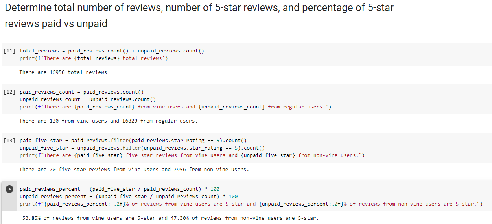

# Amazon_Vine_Analysis
## Overview
Analysis of Amazon review data to determine whether reviews from paid vine users result in more five star reviews than regular users. 

## Results

    - Reviews were pulled from the furniture category
 
    - There were 130 Vine reviews, and 16,820 non-Vine reviews

    - There were 70 5-star Vine reviews, and 7,956 5-star non-Vine reviews

    - 54% of Vine reviews were 5 stars, and 47% of non-Vine reviews were 5 stars.

## Summary
While there was a higher percentage of 5 star reviews from the Vine users, it is not a significant difference at only 7% higher than the non-paid reviewers.  

### Proposed Additional Analysis 

 - Analyze data from multiple product categories
 - Compare the average or median star-rating as opposed to the total count 